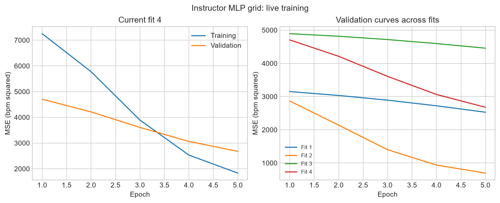
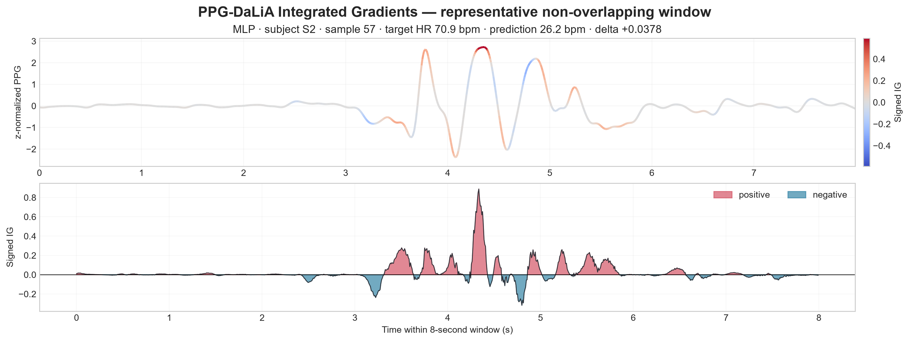

# PPG-DaLiA workshop

An installed-library workshop: formatting, signal processing, HDF5 I/O,
subject splits, training-only normalization, torch MLP training, frozen
PaPaGei-S with a trained head, and held-out error analysis.

## What this repository contains

This is the public teaching repository: both Jupyter notebooks, editable configs,
task templates and environment setup instructions. It contains no framework wheel,
framework implementation, raw dataset or pretrained weights.

**Both notebooks are also included in the private pip package.** After installing,
`ppg-workshop init ./my-ppg-workshop` writes `workshop_cpu_short.ipynb`,
`workshop.ipynb`, the configs and task folders to your computer. You can therefore
follow this README without cloning this repository.

## Choose a notebook

- `workshop_cpu_short.ipynb`: recommended live session. Six subjects x two minutes,
  two outer folds, five epochs per candidate, live learning curves, a two-candidate
  worked grid search, a separate editable participant grid block, optional frozen
  PaPaGei and Integrated Gradients on a selected held-out window.
- `workshop.ipynb`: the complete reference tour, including advanced data APIs.

Downloads must be completed before class. The short profile reduces processing
and training time, not the size of the original DaLiA download.

## Clone with notebooks ready to open

Both notebooks above are committed directly in this repository. To get them:

```sh
git clone https://github.com/PPG-BP-Framework/ppg-workshop.git
cd ppg-workshop
conda create -n ppg_workshop_showcase --override-channels -c conda-forge python=3.11 pip git -y
conda activate ppg_workshop_showcase
python -m pip install "ppg-experiment-framework[workshop] @ git+https://github.com/mamerm/ppg-workshop-runtime.git@v0.1.3"
python -m ipykernel install --sys-prefix --name ppg-workshop-showcase --display-name "PPG Workshop Showcase"
jupyter lab workshop_cpu_short.ipynb
```

Cloning this public repository needs no authentication. Installing the runtime
requires access to the private repository and Git authentication as described below.
For this clone route, skip `ppg-workshop init`: the notebooks and configs are already
here, and the notebook's first cell creates missing local data/output folders.

## Install with pip (private access)

Participants need access to [the private installer repository](https://github.com/mamerm/ppg-workshop-runtime)
and must authenticate Git with their own GitHub account. The original framework
repository is not needed. There is no manual wheel or ZIP download.

With conda installed, run:

```sh
conda create -n ppg_workshop_showcase --override-channels -c conda-forge python=3.11 pip git -y
conda activate ppg_workshop_showcase
python -m pip install "ppg-experiment-framework[workshop] @ git+https://github.com/mamerm/ppg-workshop-runtime.git@v0.1.3"
ppg-workshop init ./my-ppg-workshop --tasks baseline exercise
cd my-ppg-workshop
python -m ipykernel install --sys-prefix --name ppg-workshop-showcase --display-name "PPG Workshop Showcase"
jupyter lab workshop_cpu_short.ipynb
```

Select **PPG Workshop Showcase** in Jupyter. Existing task/template files are
preserved. The generator does not download data or start training; those steps
are explicit notebook cells.

### Authentication

The instructor grants participants access to **mamerm/ppg-workshop-runtime**.
Authenticate Git before installation. Git Credential Manager (included in Git for
Windows) can open a GitHub sign-in dialog. If you use GitHub CLI, run
`gh auth login` followed by `gh auth setup-git`. You can verify access with:

```sh
git ls-remote https://github.com/mamerm/ppg-workshop-runtime.git
```

A 404 or "repository not found" usually means the account lacks access or Git
has not authenticated. Do not put access tokens into notebooks or environment YAML.

### Exact tested Windows CPU setup

If you already have this workshop folder, authenticate Git and run
`powershell -ExecutionPolicy Bypass -File .\setup.ps1` from a conda-enabled prompt.
The script creates the environment using conda-forge, installs pinned CPU
requirements and the framework directly through pip, checks dependencies and
registers the kernel. No wheel needs to be placed in `packages/`.

Alternatively, from this folder run `conda env create -f environment.windows-cpu.yml`.
Use `environment.yml` on other platforms (not execution-tested here). Some Miniconda
installations inspect unused Anaconda channels through a terms plugin; the setup
script uses explicit conda-forge channels and avoids that issue.

After generating a workspace with the simple pip command, Windows participants
can apply the exact dependency snapshot with
`python -m pip install -r requirements-tested-windows-cpu.txt`.

See `INSTRUCTOR.md` for the agenda and `COVERAGE.md` for the API tour. Export an
activated environment with `python export_environment.py`. The export uses the
private pip URL instead of a local wheel path. Recreating it requires Git and access
to the same installer repository.

The library's `create_workspace` API remains available for Python scripts. Set
`PPG_WORKSPACE` before importing processing/training modules when running outside
the workspace; the notebook handles this automatically.

## Before the live session

Execute the download cells beforehand. DaLiA is approximately 2.7 GB compressed;
reserve at least 15 GB for the environment, extraction, intermediates and results.
PaPaGei-S is approximately 23 MB. Download/extraction are cached. The complete
download is required even in quick mode. Interrupted downloads retain `.part`
files; rerunning restarts them and only completed files receive the final name.

If an instructor provides an existing `dalia_data.zip`, place it under
`data/downloads/`. The weights are verified against the checksum published on
Zenodo. URLs and checksums are configurable in `configs/workshop.yaml`.

## Notebook and tasks

`workshop.ipynb` includes a fully worked example and a runnable reference solution
for changing MLP dropout. Ask participants to predict the effect and make the
change before revealing that cell. `tasks/baseline/` and `tasks/exercise/` provide
folders for their own configs, figures and results.

Quick mode uses six subjects, the first 600 seconds per subject, three outer
folds, and a short epoch budget. It demonstrates execution, not benchmark-quality
performance. `PPG_WORKSHOP_MODE=full` uses all subjects and complete recordings;
runtime and memory use increase substantially. Mode and settings are visible in
the notebook. The exercise changes one model setting and reuses the saved splits.

Figures include raw BVP and labels, subject coverage, waveforms and derivatives,
split membership, prediction agreement, error versus prediction/reference,
model/subject error violins, subject MAE, signed/absolute error versus mean
absolute first/second derivatives, and high-error waveforms. Outputs are PDF and
PNG. Tables retain original sample indices for auditable feature joins.

Training uses the library's formatter, DataProcessor, experiment-ready I/O,
split artifacts, static orchestrator and TorchTrainingBackend. There is no
separate notebook training loop. The runner saves exact configurations and
held-out predictions. The summary includes package versions and experiment settings.

Sections 16-21 extend the tour with disk/RAM HDF5 reads, torch loaders, a custom
transform, filtering, fitted normalization, window sequences, persisted sample/batch
transforms, alternate group splits, and Integrated Gradients with convergence plots.

## Interpretation

Positive error means prediction minus reference heart rate. Derivative features
are computed from unnormalized processed BVP using seconds as the time unit.
Window-level violin plots are descriptive: overlapping windows are not independent
subjects. Report per-subject metrics as well as pooled scores. Fit preprocessing
using training subjects only and use validation subjects for model selection.
Do not repeatedly tune against the displayed test results.

## Private distribution

This public repository contains notebook/configuration files. The separate private
[installer repository](https://github.com/mamerm/ppg-workshop-runtime) contains the built wheel and a small pip build adapter; it has
no framework development history, datasets or experiments. Participants install
using their own GitHub credentials. Nothing is published to PyPI.

The current runtime package contains CPython 3.11 bytecode instead of readable
framework `.py` files. Notebook examples and setup scripts remain readable.
Bytecode can still be disassembled or reverse engineered; this is a deterrent to
casual inspection, not confidentiality protection. CPython 3.11 is required. Access revocation
prevents new authenticated downloads but does not remove previously installed copies.
The public teaching repository has a fresh history and no source-containing ZIP
releases. The runtime repository must remain private. Older instructor repositories
and their source-containing ZIP releases are not required by participants.

## Sources

- PPG-DaLiA: Reiss, Indlekofer and Schmidt (2019), UCI Machine Learning Repository,
  https://doi.org/10.24432/C53890 (CC BY 4.0).
- Dataset timing and format: https://archive.ics.uci.edu/ml/machine-learning-databases/00495/readme.pdf
- PaPaGei: https://github.com/Nokia-Bell-Labs/papagei-foundation-model
- PaPaGei weights: https://doi.org/10.5281/zenodo.13983110

Consult upstream notices when redistributing data or weights. They are downloaded
separately and are not embedded in the wheel or public template.

## Short workshop preview

Validated on Windows CPU in about 59 seconds with data already downloaded. This
includes the worked grid, participant grid, frozen PaPaGei comparison and IG.





## Full notebook with saved outputs

[View the executed full workshop](examples/workshop_with_outputs.ipynb), including
all plots, model comparisons, the advanced API tour and Integrated Gradients.
All 26 executable cells passed in **56.7 seconds on CPU** on 8 October 2026
using the default quick profile and cached downloads. Run the clean
`workshop.ipynb` at the repository root for your own experiment.
